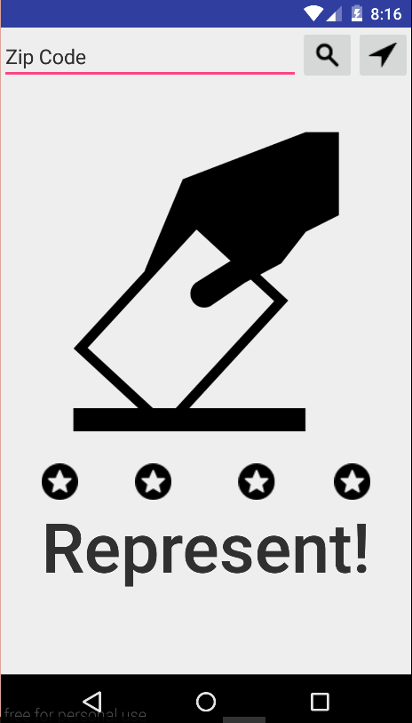
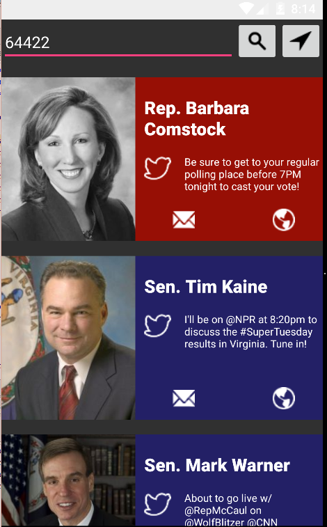
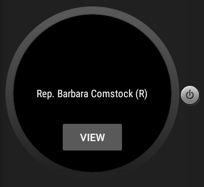

# PROG 02: Represent!

Briefly describe your app here.

## Authors

Yang Yu ([yangyu@berkeley.edu](mailto:your_email@berkeley.edu))

## Demo Video

See [Represent!] (https://youtu.be/k7PGE_YG4lI)

## Screenshots

## Acknowledgments

* Thanks to all the Staff and Professor Paulos for making CS160 so wonderful
* The Noun Project for providing me with some icons to work with
